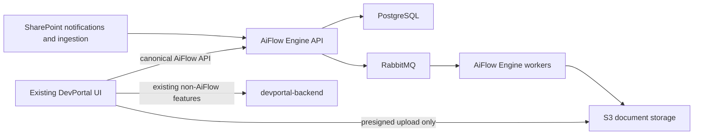

# DevPortal compatibility contract

Status: discovery baseline, 2026-07-14.

This document records the current AiFlow contract that the existing DevPortal UI consumes and defines the compatibility boundary for AiFlow Engine. It separates behavior that users rely on from n8n and Google implementation details that must not enter the engine core.

## Evidence and scope

The baseline was read from these repository snapshots:

- `devportal` at `2fc93d8ba136846f45df3a5d0f2bfa7e6b1cc38f`
- `devportal-backend` at `c546a2fdedf2fe26719c1effd5ccfe71c068dfe6`
- `aiflow-engine` starting point at `4269c0a297d52e57492b4c7d36aef779a128c52d`

Primary evidence:

- `devportal/frontend/src/constants/api.js`
- `devportal/frontend/src/constants/paths.js`
- `devportal/frontend/src/services/workflow.service.js`
- `devportal/frontend/src/routes/Workflow/**`
- `devportal/frontend/src/routes/ReviewAPI/**`
- `devportal-backend/src/routes/workflow.routes.js`
- `devportal-backend/src/controllers/workflow/**`
- `devportal-backend/document/aiflow.md`

The findings below are source-code contracts, not captured production traffic. Production consumers, edge routing, and deployed payload variants still need validation.

## Fixed boundary

1. Keep the existing DevPortal frontend and its project navigation, three-step wizard, workflow table, demo/upload page, and review page.
2. DevPortal calls AiFlow Engine directly for all new AiFlow functionality through the platform API gateway.
3. Allow small, localized DevPortal changes where the old behavior violates the new architecture: generic connector fields, direct S3 upload, execution status/retry, opaque workflow identifiers, and authenticated tenant context.
4. Do not expose n8n node types, n8n identifiers, Google credential shapes, or legacy payload versions in AiFlow Engine domain entities.
5. Do not add a second frontend or make DevPortal call internal worker services.
6. `devportal-backend` continues its non-AiFlow responsibilities and temporary legacy traffic, but the engine runtime never calls or depends on it.
7. Keep the real `devportal` and `devportal-backend` repositories unchanged through the engine foundation and internal-demo phases. Begin localized integration only after the canonical engine flow is proven.



AiFlow Engine owns the canonical API plus workflow truth, workflow versions, connections, documents, executions, review state, and activation state. Legacy v1/v2 translation exists only in migration tooling or a temporary legacy ingress adapter, never in `devportal-backend` for newly created workflows.

## Current user journeys

| Journey               | Current UI route                                       | Current behavior                                                                 | Compatibility decision                                                                                              |
| --------------------- | ------------------------------------------------------ | -------------------------------------------------------------------------------- | ------------------------------------------------------------------------------------------------------------------- |
| Project workflow list | `/aiFlow/project/:projectId`                           | Lists workflows, activation, endpoint, edit/delete, interact, and review actions | Preserve route and table layout; consume the canonical engine list response                                         |
| Create                | `/aiFlow/create/project/:projectId`                    | Three-step wizard: identity/service, trigger/output/fields, summary              | Preserve three steps; replace Step Two contents with schema-driven entry and destination configuration              |
| Edit                  | `/aiFlow/edit/project/:projectId/workflow/:workflowId` | Loads one workflow and reuses the three-step shape                               | Preserve route; make `workflowId` opaque instead of calling `parseInt`                                              |
| Connections           | `/aiFlow/credentials`                                  | CRUD for Google OAuth credentials and consent                                    | Preserve page location; present generic engine connections and provider consent                                     |
| Demo/upload           | `/aiFlow/:workflowId`                                  | Converts a file to base64 and posts it to `endpoint_url`                         | Preserve page; intentionally replace transport with upload session -> direct S3 -> completion -> execution status   |
| Review list           | `/reviewlist/aiflow/:projectId/:workflowId`            | Lists pending review URLs for a workflow                                         | Preserve route and list; project engine review tasks into the current table shape                                   |
| Review item           | `/review?token=...&aiflow=...&webhook=...`             | Loads data from Review API and posts approval to the workflow webhook            | Preserve page initially; replace trusted boolean headers with an authenticated, idempotent review decision contract |

## Current legacy browser-to-BFF HTTP surface

All paths below are under `/devportal-backend-api`. Successful workflow responses normally use `{ "data": ... }`.

| Method and path                                                     | UI use                                                 | Compatibility disposition                                                                                             |
| ------------------------------------------------------------------- | ------------------------------------------------------ | --------------------------------------------------------------------------------------------------------------------- |
| `GET /workflow/users`                                               | Gate the AiFlow home page through `data[0].user_exist` | Remove the n8n-user concept and the localized UI gate; no engine user resource                                        |
| `POST /workflow/users`                                              | First-time AiFlow initialization                       | Remove from the new UI path                                                                                           |
| `GET /workflow/project/:projectId`                                  | Workflow table                                         | Replace with direct canonical engine list query                                                                       |
| `GET /workflow/project/:projectId/workflow/:workflowId`             | Edit wizard                                            | Replace with direct canonical engine get query                                                                        |
| `POST /workflow`                                                    | Create wizard                                          | Replace with canonical workflow creation                                                                              |
| `PUT /workflow`                                                     | Edit wizard                                            | Replace with immutable canonical workflow-version creation                                                            |
| `DELETE /workflow/project/:projectId/workflow/:workflowId`          | Workflow table                                         | Replace with canonical engine deletion/archive                                                                        |
| `POST /workflow/:workflowId/activate`                               | Workflow table                                         | Replace with canonical engine activation                                                                              |
| `POST /workflow/:workflowId/deactivate`                             | Workflow table                                         | Replace with canonical engine deactivation                                                                            |
| `GET /workflow/appevent`                                            | Step Two application list                              | Replace with direct connector/action descriptor queries                                                               |
| `GET /workflow/appevent/operation/:appEventId`                      | Step Two event list                                    | Replace with connector action schema/options                                                                          |
| `GET /workflow/ml/field/service/:serviceId`                         | Step Two field mapping                                 | Replace with the canonical extraction-profile field schema                                                            |
| `GET /workflow/credentials`                                         | Connections page and Step Two                          | Replace with direct engine connection queries                                                                         |
| `GET /workflow/credential-types`                                    | Connections page                                       | Replace hard-coded Google types with connector descriptors                                                            |
| `POST /workflow/credentials`                                        | Connections page and automatic connection creation     | Replace with engine connection creation; never return encrypted provider secret material                              |
| `GET /workflow/credentials/:credentialId`                           | Consent status and edit                                | Replace with canonical connection status                                                                              |
| `PUT /workflow/credentials/:credentialId`                           | Rename/edit connection                                 | Replace with canonical connection metadata/config update                                                              |
| `DELETE /workflow/credentials/:credentialId`                        | Delete with used-by-workflow warning                   | Preserve used-by behavior; engine enforces references and explicit force semantics                                    |
| `GET /workflow/credentials/consent/:credentialId`                   | Opens OAuth consent URL                                | Translate to provider-specific consent start; callback ownership must be engine/connector controlled                  |
| `GET /workflow/gdrive/list/folder`                                  | Google folder picker                                   | Not part of the Microsoft-first release; replace with generic connection resource browsing when Google is added later |
| `GET /workflow/gdrive/list/file`                                    | Google file/sheet picker                               | Same as above                                                                                                         |
| `POST /workflow/gdrive/files`                                       | Creates a Google folder or spreadsheet                 | Remove from the Microsoft-first UI; future providers use connector actions rather than provider-named engine APIs     |
| `GET /workflow/review/item/project/:projectId/workflow/:workflowId` | Review list                                            | Replace with a direct canonical review-task query                                                                     |

The frontend does not currently reference these additional legacy workflow routes: `DELETE /workflow/users`, `GET /workflow/trigger`, `GET /workflow/gdrive/files`, `GET /workflow`, `GET /workflow/:workflowId`, `GET /workflow/project/:projectId/endpoint/:workflowEndpoint`, `POST /workflow/custom`, `DELETE /workflow/project/:projectId`, `POST /workflow/review/item`, and `DELETE /workflow/review/item`. They must not be declared safe to remove until non-frontend consumers and production traffic are checked.

## Current create and update payload

The current frontend always submits `payload_version: "v1"`. Create additionally sets `active: true`; update retains the loaded active value. A representative payload is:

```json
{
  "active": true,
  "project_id": 31,
  "key_type": "SB",
  "is_review": false,
  "workflow_name": "Invoice intake",
  "nodes": {
    "trigger": {
      "name": "Webhook Trigger",
      "type": "basic-nodes-base.webhook"
    },
    "service": {
      "name": "General Invoice",
      "type": "aigen-nodes-base.general-invoice",
      "serviceId": "service-uuid",
      "serviceName": "general-invoice",
      "serviceTitle": "General Invoice"
    },
    "appevent": {
      "name": "Google Sheets",
      "type": "basic-nodes-base.googleSheets",
      "parameters": {
        "authentication": "oAuth2",
        "operation": "append",
        "dimension": "horizontal",
        "sheetId": "sheet-id",
        "spreadSheetName": ""
      },
      "credentials": {
        "googleSheetsOAuth2Api": {
          "id": "14",
          "name": "Google Sheets account"
        }
      }
    }
  },
  "fields": [
    {
      "field_id": "invoice_number",
      "field_name": "Invoice Number"
    }
  ],
  "payload_version": "v1"
}
```

Update adds `workflow_id`, `previous_service`, and `previous_fields` through the edit wizard. The legacy backend validator currently requires `x-client-id`, `project_id`, `key_type`, `is_review`, `workflow_name`, `nodes`, and `payload_version`; update also requires `workflow_id`.

Although `devportal-backend` documents and can produce payload v2, the current UI dereferences `app_connection.trigger`, `.service`, and `.appevent` as a v1 object. A mixed v1/v2 response is therefore not a safe UI contract. Migration tooling must normalize both forms into the canonical definition; the new engine API accepts and emits neither legacy shape.

## Field classification

| Current field                                      | User intent to preserve                 | Canonical interpretation                                          | Treatment                                         |
| -------------------------------------------------- | --------------------------------------- | ----------------------------------------------------------------- | ------------------------------------------------- |
| `project_id`                                       | Workflow belongs to a DevPortal project | `projectId`/tenant-scoped parent                                  | Stable                                            |
| `workflow_name`                                    | User-visible name                       | `workflow.name`                                                   | Stable                                            |
| `active`                                           | Whether new documents may enter         | Activation of a validated workflow version                        | Stable behavior, different implementation         |
| `is_review`                                        | Human review required                   | `reviewPolicy.required`                                           | Stable                                            |
| `nodes.service.serviceId`                          | Selected extraction service/profile     | `extraction.profileId`                                            | Stable intent                                     |
| `nodes.service` labels                             | Display title/icon lookup               | Extraction catalog projection                                     | Do not store duplicated labels as authority       |
| `fields[].field_id`                                | Extracted source field                  | Mapping source path                                               | Stable                                            |
| `fields[].field_name`                              | User-selected output label              | Mapping destination field/label                                   | Stable, exact semantics need destination contract |
| Trigger selection                                  | Direct API/upload or external source    | Entry connector plus entry configuration                          | Stable intent                                     |
| Application/event selection                        | Destination and operation               | Destination connector/action/configuration                        | Stable intent                                     |
| `operation`, `dimension`, resource IDs             | Destination action details              | Connector-owned validated configuration                           | Stable only inside a connector schema             |
| `workflow_id`                                      | Route/action identifier                 | Opaque engine `workflowId`                                        | Stop treating it as an n8n numeric ID             |
| `endpoint`/`endpoint_url`                          | Public interaction address              | Entry endpoint or upload capability projection                    | Preserve display/copy behavior where applicable   |
| `client_id`/`x-client-id`                          | Current tenant lookup                   | Derived tenant/actor from validated token                         | Remove; never trust browser input                 |
| `key_type`                                         | Current key-manager permission variant  | Server-resolved project entitlement/policy                        | Compatibility-only request field                  |
| `payload_version`                                  | n8n graph DTO shape                     | Not canonical workflow versioning                                 | Compatibility-only                                |
| `nodes` and `app_connection`                       | Serialized n8n-oriented graph           | Structured entry/extraction/mapping/review/destination definition | Translate during migration; never store as core   |
| `basic-nodes-base.*` and `aigen-nodes-base.*`      | Implementation-specific type tags       | Connector/profile IDs                                             | Compatibility-only aliases                        |
| `{credentials: {type: {id,name}}}`                 | Connection reference                    | `connectionId`                                                    | Flatten and validate server-side                  |
| `folderToWatch`, `sheetId`, Google credential keys | Google implementation                   | Future Google connector configuration                             | Excluded from Microsoft-first core contracts      |

## Current workflow list/get response

The UI consumes this v1-shaped projection:

```json
{
  "data": [
    {
      "id": 43,
      "active": true,
      "client_id": "legacy-client-id",
      "endpoint": "entry-slug",
      "endpoint_url": "https://aiflow.example/entry/entry-slug",
      "is_review": false,
      "is_standard": true,
      "project_id": "31",
      "workflow_id": "125",
      "workflow_name": "Invoice intake",
      "workflow_type": "standard",
      "app_connection": {
        "trigger": {},
        "service": {},
        "appevent": {}
      },
      "exclamation_mark": false,
      "fields": [
        {
          "field_id": "invoice_number",
          "field_name": "Invoice Number"
        }
      ],
      "payload_version": "v1"
    }
  ]
}
```

Important consumers:

- Table identity/actions use `workflow_id`, not database `id`.
- Edit currently parses `workflowId` as an integer.
- Interaction routing checks `app_connection.trigger.type` for the hard-coded webhook type.
- Google Drive entries open a hard-coded Google URL using `folderToWatch`.
- Icons and credential warnings inspect hard-coded node and credential keys.
- The review-list request copies returned `client_id` back into `x-client-id`.

Recommended localized UI changes are to treat identifiers as opaque strings, render connector metadata returned by AiFlow Engine, use an explicit `entry.interaction` capability instead of checking node types, and stop returning/echoing `client_id`.

## Canonical DevPortal-to-engine contract

Canonical HTTP paths and payloads are defined in [`canonical-api-v1.md`](canonical-api-v1.md). The initial resource vocabulary is:

| Legacy concept                           | Engine concept                                                         |
| ---------------------------------------- | ---------------------------------------------------------------------- |
| Workflow shelf record                    | `Workflow`                                                             |
| `payload_version` plus mutable n8n graph | Immutable `WorkflowVersion`                                            |
| Trigger node                             | `EntryConfig` using an entry connector descriptor                      |
| Service node                             | `ExtractionConfig` referencing an extraction profile                   |
| `fields`                                 | Ordered `MappingRule` set                                              |
| `is_review`                              | `ReviewPolicy`                                                         |
| App-event node                           | `DestinationConfig` using a destination connector/action               |
| n8n credential                           | `Connection` reference; secrets remain in the approved secret boundary |
| Active n8n workflow                      | Active engine workflow version                                         |
| Webhook execution                        | `Document` plus `Execution`                                            |
| Review item                              | `ReviewTask` attached to an execution                                  |

A canonical definition should express intent rather than nodes, for example:

```json
{
  "projectId": "31",
  "name": "Invoice intake",
  "definition": {
    "entry": {
      "connectorId": "direct-upload",
      "config": {}
    },
    "extraction": {
      "profileId": "service-uuid"
    },
    "mappings": [
      {
        "source": "invoice_number",
        "destination": "number"
      }
    ],
    "reviewPolicy": {
      "required": false
    },
    "destination": {
      "connectorId": "microsoft-business-central",
      "connectionId": "connection-uuid",
      "actionId": "create-purchase-invoice-draft",
      "config": {}
    }
  }
}
```

Connector descriptors must provide display metadata, connection requirements, JSON Schema-compatible configuration, secret annotations, resource-browse capabilities, and supported actions. Step Two renders those descriptors inside the existing wizard. A future Google connector can then be added without changing engine domain types or adding `/gdrive/*` APIs.

## Upload and execution compatibility

The current demo page sends document bytes as base64 JSON:

```json
{
  "image": "base64-without-data-url-prefix"
}
```

It posts directly to `endpoint_url` with a project `X-AIGEN-KEY`. For review it also trusts `x-aiflow-enable-review`, `x-aiflow-redirect-url`, and `x-aiflow-review-expire` headers. This transport must not be retained for the new UI because it sends the full document through an HTTP application runtime and provides no durable execution identifier.

The localized replacement flow is:

1. DevPortal requests an upload session for a workflow.
2. AiFlow Engine authorizes project/workflow access and returns a short-lived presigned single-part or multipart S3 upload plan.
3. The browser streams the file directly to S3.
4. DevPortal completes the upload session with size, checksum, content type, and idempotency key.
5. AiFlow Engine durably creates one document/execution and returns `executionId`.
6. The existing page shows state, failure details, and safe retry by querying the execution.

The engine selects the self-describing single-part or multipart plan. DevPortal follows that plan without generating bucket names, object keys, KMS settings, or alternative validation rules. Exact behavior is defined in [`storage-v1.md`](storage-v1.md).

The DevPortal demo call is therefore an intentional localized contract change. Compatibility for external callers of the existing public `endpoint_url` is a separate discovery item; those callers cannot be inferred from the frontend repository.

SharePoint entries do not pass through DevPortal or `devportal-backend` after provisioning. Notifications enter the engine connector, a worker streams the object from Microsoft Graph into S3, and processing joins the same staged-document boundary as direct upload.

## Review compatibility

Confirmed current behavior:

- Initial invocation may return `review_full_url`.
- DevPortal extracts `token`, `aiflow`, and `webhook` query parameters and opens the existing `/review` page.
- The page loads the review document/result from the existing Review API.
- Approval posts `{token,data,enable_feedback,meta}` directly to the workflow endpoint with `x-aiflow-enable-review: true` and `x-aiflow-review-approved: true`.
- The visible flow implements approval; Cancel only returns to editing and is not a durable rejection decision.

Target behavior:

- Engine review state is keyed by `reviewTaskId` and `executionId`.
- The existing Review System remains behind an adapter until ownership is agreed.
- Approval/rejection is authenticated, expiring, idempotent, and transition-guarded.
- No boolean header is sufficient authority to resume an execution.
- Waiting for review uses no worker slot and no unacknowledged RabbitMQ delivery.
- The existing review page consumes the canonical review-task resource with only localized display mapping.

## Authentication and tenancy finding

The workflow frontend reads `user.sub` from local storage and sends it as `x-client-id` on every workflow request. The legacy workflow routes import Keycloak but do not apply `keycloak.protect(...)`; other backend route groups do. Repository code therefore does not prove authentication or tenant binding for the workflow routes. An upstream gateway may add protection, but that was not validated here.

The replacement contract is non-negotiable:

- DevPortal sends its bearer token through the normal authenticated client.
- AiFlow Engine validates issuer, audience, signature, expiry, and required roles using the platform authentication contract.
- Tenant, actor, and service identity are derived from agreed claims and server-side project ownership.
- `x-client-id` may not select a tenant under any mode.
- Every engine query and mutation enforces tenant/project scope.

## Error compatibility

Current documented errors use a variable shape such as:

```json
{
  "status": "error",
  "statusCode": 401,
  "message": "Not Found"
}
```

`message` is sometimes a string and sometimes an object. Temporary legacy routes may keep this envelope for old callers, but AiFlow Engine uses one canonical error envelope:

```json
{
  "error": {
    "code": "WORKFLOW_CONFIGURATION_INVALID",
    "message": "Workflow configuration is invalid",
    "retryable": false,
    "correlationId": "correlation-id",
    "details": []
  }
}
```

New DevPortal code consumes canonical engine errors directly. Engine error codes remain stable and machine-readable; any temporary legacy translation stays outside engine-core modules.

## Required contract fixtures

Before Phase 3 implementation, capture and sanitize production-equivalent fixtures for:

1. User-exists bootstrap and its empty/error cases.
2. Workflow list/get for active, inactive, review-enabled, missing-connection, custom, v1, and any deployed v2 workflows.
3. Create/update for webhook and Google Drive legacy workflows, including validation failures.
4. Activate/deactivate/delete success, not-found, in-use, and provider failure behavior.
5. Connection list/create/consent/status/update/delete, including used-by-workflow and re-consent cases.
6. Extraction field catalogs and renamed/ordered mappings.
7. Direct invocation with and without review, plus the returned `review_full_url` shape.
8. Review list and duplicate approval behavior.
9. Every current consumer of public `endpoint_url`, `/workflow/custom`, and backend-only review-item endpoints.

Contract tests should assert the direct DevPortal/engine contract separately from legacy migration parsing. Legacy field names should appear only in migration fixtures and adapter code.

## Localized DevPortal change list

| Area                           | Required change                                                                                                    |
| ------------------------------ | ------------------------------------------------------------------------------------------------------------------ |
| `services/workflow.service.js` | Send bearer authentication, remove `x-client-id`, and add upload/execution calls                                   |
| Create/Edit Step One           | Obtain extraction profiles from a catalog rather than a hard-coded service UUID allowlist                          |
| Create/Edit Step Two           | Render generic entry/destination connector descriptors and schemas; remove Google/n8n-specific state               |
| Create/Edit Step Three         | Summarize connector intent and submit the canonical definition without `payload_version` or mutable `nodes`        |
| Edit route                     | Treat workflow identifier as an opaque string                                                                      |
| Workflow table mapper          | Use returned connector display/capability metadata; remove hard-coded node types, Google URLs, and credential keys |
| Demo page                      | Upload directly to S3 and show execution state/retry                                                               |
| Connections page               | Rename credential semantics to connections and render provider status/consent                                      |
| Review request mapping         | Remove returned `client_id` and browser-selected tenant header                                                     |
| Review approval                | Call an authenticated review-decision endpoint or compatible adapter URL, not an authority-by-header webhook       |

These changes keep the current routes, Redux organization, page ownership, and overall visual flow.

## Open discovery items

This inventory does not close Phase 0B. The following items still block later phase contracts:

1. Confirm exact auth token claims for tenant, actor, roles, project access, and service identities.
2. Confirm whether edge infrastructure currently authenticates `/workflow/*` and inventory every non-DevPortal caller.
3. Export counts and examples of deployed v1, v2, custom, system, active, and review-enabled workflows.
4. Decide compatibility/redirect requirements for existing public `endpoint_url` callers.
5. Confirm the extraction catalog/profile values required by [`ocr-v1.md`](ocr-v1.md) after `devportal-backend` no longer owns `ml_field`.
6. Confirm Review System ownership, approval/rejection callback, token, expiry, and artifact-retention contracts.
7. Confirm the Microsoft product, action, connection, and schema values required by [`dynamics-destination-v1.md`](dynamics-destination-v1.md).
8. Confirm connection secret ownership and OAuth callback ingress in the existing platform.

## Acceptance criteria for this contract slice

- The existing DevPortal journeys and every frontend-called workflow endpoint are listed.
- Stable user intent is separated from legacy n8n/Google fields.
- The direct DevPortal-to-engine boundary and required localized UI changes are explicit.
- Direct upload and SharePoint entry converge on a common staged-document execution path.
- Authentication, opaque identifier, payload v1/v2, and review risks are recorded.
- Remaining production evidence is listed rather than assumed.
