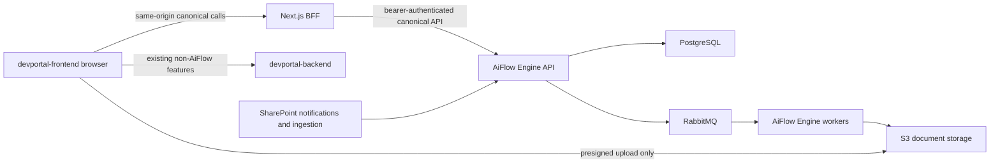

# DevPortal compatibility contract

Status: Phase 3 implementation baseline, corrected and revalidated 2026-07-22.

This document records the current AiFlow contract that the existing DevPortal UI consumes and defines the compatibility boundary for AiFlow Engine. It separates behavior that users rely on from n8n and Google implementation details that must not enter the engine core.

## Evidence and scope

The active Phase 3 baseline was read from these repository snapshots:

- `devportal-frontend` at `f1c9a9bad23c357a67fef1ddfaba1a8a4d0fa436`,
  based on `origin/feature/new-uxui`
- `devportal-backend` at `4b74f99c5370aab7c55ceeb639510abe7a9fbca0`,
  based on `origin/develop`
- `aiflow-engine` Phase 3 starting point at
  `84b646e4d6e0a97c41f8c53d258db8fe6bae633f`

Primary evidence:

- `devportal-frontend/frontend/src/lib/api/client.ts`
- `devportal-frontend/frontend/src/lib/api/endpoints.ts`
- `devportal-frontend/frontend/src/app/api/proxy/[...path]/route.ts`
- `devportal-frontend/frontend/src/types/workflow.ts`
- `devportal-frontend/frontend/src/features/workflows/api/**`
- `devportal-frontend/frontend/src/features/workflows/components/**`
- `devportal-frontend/frontend/src/app/(main)/workflows/**`
- `devportal-backend/src/routes/workflow.routes.js`
- `devportal-backend/src/handler/workflow/**`
- `devportal-backend/document/aiflow.md`

The earlier `devportal` snapshot at
`2fc93d8ba136846f45df3a5d0f2bfa7e6b1cc38f` remains historical discovery
evidence only. It is not the integration target. Its local checkout was removed
after the corrected frontend was verified so the two implementations cannot be
confused.

The findings below are source-code contracts, not captured production traffic. Production consumers, edge routing, and deployed payload variants still need validation.

The corrected repositories were clean before branching. Both now use the local
branch `phase3/aiflow-engine-integration`, created from the exact frontend and
backend bases listed above. The frontend is a Next.js App Router application
using TanStack Query and localized feature modules; compatibility work must
preserve that structure and the current UX rather than the historical Redux
implementation.

## Phase 3 implementation readiness

Phase 2 proved the canonical direct-upload journey without changing either
legacy repository. The remaining compatibility work is intentionally divided
at the public API and frontend service seams:

| Surface                  | Engine state at Phase 3 entry                                                                                  | Phase 3 action                                                                                               |
| ------------------------ | -------------------------------------------------------------------------------------------------------------- | ------------------------------------------------------------------------------------------------------------ |
| Workflow create/list/get | Implemented and exercised by the demo harness                                                                  | Reuse directly from the existing workflow service                                                            |
| Immutable workflow edit  | Create/list/get API and typed client implemented                                                               | Migrate the edit builder after activation/archive lifecycle projections are complete                         |
| Activation               | Request/poll/read and immediate idempotent deactivation implemented for current connectors                     | Add managed cleanup operations only when Phase 4 installs SharePoint provisioning bindings                   |
| Workflow removal         | Idempotent archive-only API implemented                                                                        | Map the current delete action to deactivate-then-archive confirmation; no hard delete                        |
| Catalogs                 | Connector/profile list and detail APIs, capability filtering, display projection, and typed client implemented | Consume through the existing wizard service/query seams                                                      |
| Connections              | Not implemented                                                                                                | Add Business Central connection APIs before exposing real destination setup                                  |
| Direct upload/execution  | Implemented, including retry and recovery                                                                      | Replace the demo page's base64 invocation at its service boundary                                            |
| Authentication           | Local test identity only; production fails closed                                                              | Add the approved OIDC and project-authorization adapters before real DevPortal traffic                       |
| Review                   | Engine review resources are intentionally deferred                                                             | Preserve legacy routes for existing workflows; new review-enabled workflows remain unavailable until Phase 5 |

Implementation order:

1. Complete the canonical workflow lifecycle and typed client in AiFlow Engine.
2. Add the production authentication/project-authorization boundary once the
   platform claim and endpoint values are supplied.
3. Integrate through the existing API/query seams on the prepared
   `devportal-frontend` Phase 3 branch; preserve App Router paths, TanStack Query
   ownership, feature boundaries, and the current workflow UX.
4. Prove create, edit, activate/deactivate, archive, direct upload, execution
   status, and retry with canonical contract fixtures.
5. Inventory deployed legacy callers before redirecting or retiring any n8n
   endpoint. Do not route newly created workflows through
   `devportal-backend`.

## Fixed boundary

1. Keep `devportal-frontend` and its project navigation, workflow builder journey, workflow table, demo/upload page, execution views, and review page.
2. DevPortal client components call same-origin Next.js BFF routes. The BFF forwards canonical requests and the authenticated bearer token to AiFlow Engine through the platform API gateway.
3. Allow small, localized DevPortal changes where the old behavior violates the new architecture: generic connector fields, direct S3 upload, execution status/retry, opaque workflow identifiers, and authenticated tenant context.
4. Do not expose n8n node types, n8n identifiers, Google credential shapes, or legacy payload versions in AiFlow Engine domain entities.
5. Do not add a second frontend or make DevPortal call internal worker services.
6. `devportal-backend` continues its non-AiFlow responsibilities and temporary legacy traffic, but the engine runtime never calls or depends on it.
7. Phase 2 kept the real frontend/backend unchanged. Phase 3 now applies localized integration only in `devportal-frontend`; `devportal-backend` remains outside the new AiFlow runtime path.



AiFlow Engine owns the canonical API plus workflow truth, workflow versions, connections, documents, executions, review state, and activation state. Legacy v1/v2 translation exists only in migration tooling or a temporary legacy ingress adapter, never in `devportal-backend` for newly created workflows.

## Current user journeys

| Journey               | Current UI route                                  | Current behavior                                                                      | Compatibility decision                                                                                            |
| --------------------- | ------------------------------------------------- | ------------------------------------------------------------------------------------- | ----------------------------------------------------------------------------------------------------------------- |
| Project workflow list | `/workflows?projectId=...`                        | Lists workflows, activation, endpoint, edit/delete, demo, review, and history actions | Preserve route and table UX; consume the canonical engine list response                                           |
| Create                | `/workflows/new?projectId=...`                    | Builder groups name/service, trigger, and output into the current two-page journey    | Preserve journey and business sections; replace legacy node data with schema-driven connector configuration       |
| Edit                  | `/workflows/:workflowId/edit?projectId=...`       | Loads one workflow and reuses the builder                                             | Preserve route and opaque string identifier; map canonical workflow/version resources                             |
| Connections           | `/workflows/credentials`                          | Manages Google and Microsoft credentials/consent                                      | Preserve page location; present generic engine connections and provider consent                                   |
| Demo/upload           | `/workflows/:workflowId/demo?projectId=...`       | Converts a file to base64 and posts it to `endpoint_url` with `X-AIGEN-KEY`           | Preserve page; intentionally replace transport with upload session -> direct S3 -> completion -> execution status |
| Execution history     | `/workflows/:workflowId/executions?projectId=...` | Shows legacy execution history                                                        | Preserve page and project canonical execution projections                                                         |
| Review list           | `/workflows/:workflowId/reviews?projectId=...`    | Lists pending review URLs for a workflow                                              | Preserve route and list; project engine review tasks into the current table shape                                 |
| Global executions     | `/workflows/executions`                           | Shows project-scoped execution history                                                | Preserve route and query canonical execution resources                                                            |

## Current legacy browser-to-BFF HTTP surface

All paths below are under `/devportal-backend-api`. Successful workflow responses normally use `{ "data": ... }`.

| Method and path                                                     | UI use                                                 | Compatibility disposition                                                                                             |
| ------------------------------------------------------------------- | ------------------------------------------------------ | --------------------------------------------------------------------------------------------------------------------- |
| `GET /workflow/users`                                               | Gate the AiFlow home page through `data[0].user_exist` | Remove the n8n-user concept and the localized UI gate; no engine user resource                                        |
| `POST /workflow/users`                                              | First-time AiFlow initialization                       | Remove from the new UI path                                                                                           |
| `GET /workflow/project/:projectId`                                  | Workflow table                                         | Replace with direct canonical engine list query                                                                       |
| `GET /workflow/project/:projectId/workflow/:workflowId`             | Edit wizard                                            | Replace with direct canonical engine get query                                                                        |
| `POST /workflow`                                                    | Create wizard                                          | Replace with canonical workflow creation                                                                              |
| `PUT /workflow`                                                     | Edit wizard                                            | Replace with immutable canonical workflow-version creation                                                            |
| `DELETE /workflow/project/:projectId/workflow/:workflowId`          | Workflow table                                         | Replace with canonical engine deletion/archive                                                                        |
| `POST /workflow/:workflowId/activate`                               | Workflow table                                         | Replace with canonical engine activation plus operation polling                                                       |
| `POST /workflow/:workflowId/deactivate`                             | Workflow table                                         | Replace with canonical engine deactivation plus cleanup status                                                        |
| `GET /workflow/appevent`                                            | Step Two application list                              | Replace with direct connector/action descriptor queries                                                               |
| `GET /workflow/appevent/operation/:appEventId`                      | Step Two event list                                    | Replace with connector action schema/options                                                                          |
| `GET /workflow/trigger`                                             | Trigger selector                                       | Replace with entry connector descriptors                                                                              |
| `POST /workflow/trigger/gmail-labels`                               | Gmail label picker                                     | Exclude from Microsoft-first flow; retain only for controlled legacy traffic                                          |
| `GET /workflow/ml/field/service/:serviceId`                         | Step Two field mapping                                 | Replace with the canonical extraction-profile field schema                                                            |
| `GET /workflow/credentials`                                         | Connections page and Step Two                          | Replace with direct engine connection queries                                                                         |
| `GET /workflow/credential-types`                                    | Connections page                                       | Replace hard-coded Google types with connector descriptors                                                            |
| `POST /workflow/credentials`                                        | Connections page and automatic connection creation     | Replace with engine connection creation; never return encrypted provider secret material                              |
| `GET /workflow/credentials/:credentialId`                           | Consent status and edit                                | Replace with canonical connection status                                                                              |
| `PUT /workflow/credentials/:credentialId`                           | Rename/edit connection                                 | Replace with canonical connection metadata/config update                                                              |
| `DELETE /workflow/credentials/:credentialId`                        | Delete with used-by-workflow warning                   | Preserve used-by behavior; engine enforces references and explicit force semantics                                    |
| `GET /workflow/credentials/consent/:credentialId`                   | Opens OAuth consent URL                                | Translate to provider-specific consent start; callback ownership must be engine/connector controlled                  |
| `GET /workflow/gdrive/list/folder`                                  | Google folder picker                                   | Not part of the Microsoft-first release; replace with generic connection resource browsing when Google is added later |
| `GET /workflow/gdrive/list/file`                                    | Google file/sheet picker                               | Same as above                                                                                                         |
| `GET /workflow/drive/files`                                         | Browses SharePoint sites, drives, folders, and files   | Replace with provider-neutral engine connection-resource browsing in Phase 4                                          |
| `POST /workflow/drive/files`                                        | Creates a provider folder or spreadsheet               | Replace with a declared connector action rather than a drive-named engine endpoint                                    |
| `GET /workflow/execution/:projectId`                                | Workflow and global execution-history pages            | Replace with canonical project/workflow execution queries                                                             |
| `GET /workflow/execution/status`                                    | Execution status filter                                | Replace with canonical execution status vocabulary                                                                    |
| `GET /workflow/review/item/project/:projectId/workflow/:workflowId` | Review list                                            | Replace with a direct canonical review-task query                                                                     |
| `GET /workflow/microsoft/tenant/:tenantId/adminconsent/link`        | Starts Microsoft admin consent                         | Move to the engine-owned Microsoft connection/consent boundary                                                        |
| `GET /workflow/microsoft/tenant/:tenantId/adminconsent`             | Reads Microsoft admin-consent status                   | Move to the engine-owned Microsoft connection status projection                                                       |

The frontend does not currently reference these additional legacy workflow
operations: `DELETE /workflow/users`, `GET /workflow`,
`GET /workflow/:workflowId`,
`GET /workflow/project/:projectId/endpoint/:workflowEndpoint`,
`POST /workflow/custom`, `DELETE /workflow/project/:projectId`,
`POST /workflow/review/item`, `DELETE /workflow/review/item`, and
`POST /workflow/execution`. They must not be declared safe to remove until
non-frontend consumers and production traffic are checked.

## Current create and update payload

The current frontend always submits `payload_version: "v1"`. Create additionally sets `active: true`; update retains the loaded active value. A representative payload is:

```json
{
  "active": true,
  "project_id": 31,
  "key_type": "SB",
  "is_review": false,
  "workflow_name": "Invoice intake",
  "nodes": {
    "trigger": {
      "name": "Webhook Trigger",
      "type": "basic-nodes-base.webhook"
    },
    "service": {
      "name": "General Invoice",
      "type": "aigen-nodes-base.general-invoice",
      "serviceId": "service-uuid",
      "serviceName": "general-invoice",
      "serviceTitle": "General Invoice"
    },
    "appevent": {
      "name": "Google Sheets",
      "type": "basic-nodes-base.googleSheets",
      "parameters": {
        "authentication": "oAuth2",
        "operation": "append",
        "dimension": "horizontal",
        "sheetId": "sheet-id",
        "spreadSheetName": ""
      },
      "credentials": {
        "googleSheetsOAuth2Api": {
          "id": "14",
          "name": "Google Sheets account"
        }
      }
    }
  },
  "fields": [
    {
      "field_id": "invoice_number",
      "field_name": "Invoice Number"
    }
  ],
  "payload_version": "v1"
}
```

Update adds `workflow_id`, `previous_service`, and `previous_fields` through the edit wizard. The legacy backend validator currently requires `x-client-id`, `project_id`, `key_type`, `is_review`, `workflow_name`, `nodes`, and `payload_version`; update also requires `workflow_id`.

Although `devportal-backend` documents and can produce payload v2, the current UI dereferences `app_connection.trigger`, `.service`, and `.appevent` as a v1 object. A mixed v1/v2 response is therefore not a safe UI contract. Migration tooling must normalize both forms into the canonical definition; the new engine API accepts and emits neither legacy shape.

## Field classification

| Current field                                      | User intent to preserve                 | Canonical interpretation                                          | Treatment                                         |
| -------------------------------------------------- | --------------------------------------- | ----------------------------------------------------------------- | ------------------------------------------------- |
| `project_id`                                       | Workflow belongs to a DevPortal project | `projectId`/tenant-scoped parent                                  | Stable                                            |
| `workflow_name`                                    | User-visible name                       | `workflow.name`                                                   | Stable                                            |
| `active`                                           | Whether new documents may enter         | Server-derived active version/intake gate plus provisioning state | Stable toggle intent, asynchronous implementation |
| `is_review`                                        | Human review required                   | `reviewPolicy.required`                                           | Stable                                            |
| `nodes.service.serviceId`                          | Selected extraction service/profile     | `extraction.profileId`                                            | Stable intent                                     |
| `nodes.service` labels                             | Display title/icon lookup               | Extraction catalog projection                                     | Do not store duplicated labels as authority       |
| `fields[].field_id`                                | Extracted source field                  | Mapping source path                                               | Stable                                            |
| `fields[].field_name`                              | User-selected output label              | Mapping destination field/label                                   | Stable, exact semantics need destination contract |
| Trigger selection                                  | Direct API/upload or external source    | Entry connector plus entry configuration                          | Stable intent                                     |
| Application/event selection                        | Destination and operation               | Destination connector/action/configuration                        | Stable intent                                     |
| `operation`, `dimension`, resource IDs             | Destination action details              | Connector-owned validated configuration                           | Stable only inside a connector schema             |
| `workflow_id`                                      | Route/action identifier                 | Opaque engine `workflowId`                                        | Stop treating it as an n8n numeric ID             |
| `endpoint`/`endpoint_url`                          | Public interaction address              | Entry endpoint or upload capability projection                    | Preserve display/copy behavior where applicable   |
| `client_id`/`x-client-id`                          | Current tenant lookup                   | Derived tenant/actor from validated token                         | Remove; never trust browser input                 |
| `key_type`                                         | Current key-manager permission variant  | Server-resolved project entitlement/policy                        | Compatibility-only request field                  |
| `payload_version`                                  | n8n graph DTO shape                     | Not canonical workflow versioning                                 | Compatibility-only                                |
| `nodes` and `app_connection`                       | Serialized n8n-oriented graph           | Structured entry/extraction/mapping/review/destination definition | Translate during migration; never store as core   |
| `basic-nodes-base.*` and `aigen-nodes-base.*`      | Implementation-specific type tags       | Connector/profile IDs                                             | Compatibility-only aliases                        |
| `{credentials: {type: {id,name}}}`                 | Connection reference                    | `connectionId`                                                    | Flatten and validate server-side                  |
| `folderToWatch`, `sheetId`, Google credential keys | Google implementation                   | Future Google connector configuration                             | Excluded from Microsoft-first core contracts      |

## Current workflow list/get response

The UI consumes this v1-shaped projection:

```json
{
  "data": [
    {
      "id": 43,
      "active": true,
      "client_id": "legacy-client-id",
      "endpoint": "entry-slug",
      "endpoint_url": "https://aiflow.example/entry/entry-slug",
      "is_review": false,
      "is_standard": true,
      "project_id": "31",
      "workflow_id": "125",
      "workflow_name": "Invoice intake",
      "workflow_type": "standard",
      "app_connection": {
        "trigger": {},
        "service": {},
        "appevent": {}
      },
      "exclamation_mark": false,
      "fields": [
        {
          "field_id": "invoice_number",
          "field_name": "Invoice Number"
        }
      ],
      "payload_version": "v1"
    }
  ]
}
```

Important consumers in the corrected frontend:

- Table identity/actions use `workflow_id`, not database `id`.
- App Router parameters already preserve `workflowId` as a string, while the
  legacy request/response types still require compatibility mapping.
- Interaction routing checks `app_connection.trigger.type` for the hard-coded webhook type.
- Google Drive entries open a hard-coded Google URL using `folderToWatch`.
- Icons and credential warnings inspect hard-coded node and credential keys.
- The review-list request copies returned `client_id` back into `x-client-id`.

Recommended localized UI changes are to treat identifiers as opaque strings, render connector metadata returned by AiFlow Engine, use an explicit `entry.interaction` capability instead of checking node types, and stop returning/echoing `client_id`.

## Canonical DevPortal-to-engine contract

Canonical HTTP paths and payloads are defined in [`canonical-api-v1.md`](canonical-api-v1.md). The initial resource vocabulary is:

| Legacy concept                           | Engine concept                                                         |
| ---------------------------------------- | ---------------------------------------------------------------------- |
| Workflow shelf record                    | `Workflow`                                                             |
| `payload_version` plus mutable n8n graph | Immutable `WorkflowVersion`                                            |
| Trigger node                             | `EntryConfig` using an entry connector descriptor                      |
| Service node                             | `ExtractionConfig` referencing an extraction profile                   |
| `fields`                                 | Ordered `MappingRule` set                                              |
| `is_review`                              | `ReviewPolicy`                                                         |
| App-event node                           | `DestinationConfig` using a destination connector/action               |
| n8n credential                           | `Connection` reference; secrets remain in the approved secret boundary |
| Active n8n workflow                      | Active engine workflow version                                         |
| Webhook execution                        | `Document` plus `Execution`                                            |
| Review item                              | `ReviewTask` attached to an execution                                  |

A canonical definition should express intent rather than nodes, for example:

```json
{
  "projectId": "31",
  "name": "Invoice intake",
  "definition": {
    "entry": {
      "connectorId": "direct-upload",
      "config": {}
    },
    "extraction": {
      "profileId": "service-uuid"
    },
    "mappings": [
      {
        "source": "invoice_number",
        "destination": "number"
      }
    ],
    "reviewPolicy": {
      "required": false
    },
    "destination": {
      "connectorId": "microsoft-business-central",
      "connectionId": "connection-uuid",
      "actionId": "create-purchase-invoice-draft",
      "config": {}
    }
  }
}
```

Connector descriptors must provide display metadata, connection requirements, JSON Schema-compatible configuration, secret annotations, resource-browse capabilities, and supported actions. Step Two renders those descriptors inside the existing wizard. A future Google connector can then be added without changing engine domain types or adding `/gdrive/*` APIs.

## Custom extraction-template compatibility

The corrected frontend contains template list/create/edit routes, template API
hooks, custom-template demo behavior, and document-collection screens. These are
confirmed UI consumers, but their migration remains Phase 5 work. Phase 3 must
not silently redirect them or broaden the workflow-provisioning slice.

- The existing Step One extraction selector lists built-in and authorized custom profiles from `/api/v1/extraction-profiles`.
- A selected custom profile uses the same `definition.extraction.profileId` field as a built-in profile. Workflow-version creation freezes its exact immutable profile/template version.
- Workflow create/edit does not send a legacy `my_template_endpoint`, `client_id`, engine/model ID, direct-invoke URL, prompt envelope, or document bytes.
- Template authoring is migrated as a localized tenant administration journey over `/api/v1/extraction-templates`; it remains separate from document upload/execution.
- Existing workflows that store `(client_id, my_template_endpoint)` are migration inputs. A bounded alias may resolve them during migration/cutover, but execution never calls `personal-template-backend` to discover fields.
- Direct single/multiple-file invocation and document collections require confirmed consumers and their own migration decision; they are not silently projected into the workflow wizard.

The canonical resource, definition schema, lifecycle, permissions, output paths, and migration rules are defined in [`extraction-templates-v1.md`](extraction-templates-v1.md).

## Upload and execution compatibility

The current demo page sends document bytes as base64 JSON:

```json
{
  "image": "base64-without-data-url-prefix"
}
```

It posts directly to `endpoint_url` with a project `X-AIGEN-KEY`. For review it also trusts `x-aiflow-enable-review`, `x-aiflow-redirect-url`, and `x-aiflow-review-expire` headers. This transport must not be retained for the new UI because it sends the full document through an HTTP application runtime and provides no durable execution identifier.

The localized replacement flow is:

1. DevPortal requests an upload session through its same-origin BFF.
2. AiFlow Engine authorizes project/workflow access and returns a short-lived presigned single-part or multipart S3 upload plan.
3. The browser streams the file directly to S3.
4. DevPortal completes the upload session through its BFF with size, checksum, content type, and idempotency key.
5. AiFlow Engine durably creates one document/execution and returns `executionId`.
6. The existing page shows state, failure details, and safe retry by querying the execution.

The engine selects the self-describing single-part or multipart plan. DevPortal follows that plan without generating bucket names, object keys, KMS settings, or alternative validation rules. Exact behavior is defined in [`storage-v1.md`](storage-v1.md).

The DevPortal demo call is therefore an intentional localized contract change. Compatibility for external callers of the existing public `endpoint_url` is a separate discovery item; those callers cannot be inferred from the frontend repository.

SharePoint entries do not pass through DevPortal or `devportal-backend` after provisioning. Notifications enter the engine connector, a worker streams the object from Microsoft Graph into S3, and processing joins the same staged-document boundary as direct upload.

## Review compatibility

Confirmed current behavior:

- Initial invocation may return `review_full_url`.
- DevPortal extracts `token`, `aiflow`, and `webhook` query parameters and opens the existing `/review` page.
- The page loads the review document/result from the existing Review API.
- Approval posts `{token,data,enable_feedback,meta}` directly to the workflow endpoint with `x-aiflow-enable-review: true` and `x-aiflow-review-approved: true`.
- The visible flow implements approval; Cancel only returns to editing and is not a durable rejection decision.

Target behavior:

- Engine review state is keyed by `reviewTaskId` and `executionId`.
- The review list calls the engine with the normal bearer token and maps safe task metadata into the current table; `devportal-backend` no longer owns new review-item rows.
- The existing page opens `/review?reviewTaskId=<opaque-id>` rather than carrying a provider token, boolean mode, or workflow webhook in the query string.
- The page loads bounded mapped values from the engine and previews the exact source object through a short-lived, task-authorized, direct-S3 read capability.
- The existing Review System remains behind a presentation adapter only if its owner proves the required idempotency, authentication, access, retention, and deletion contract.
- Approval/rejection is authenticated, expiring, idempotent, and transition-guarded.
- No boolean header is sufficient authority to resume an execution.
- Waiting for review uses no worker slot and no unacknowledged RabbitMQ delivery.
- The existing review page consumes the canonical review-task/content/source-access resources with only localized display and service mapping.
- Cancel remains navigation; the target page adds an explicit durable Reject action.
- Provider signatures, revised values, arbitrary redirect URLs, and long-lived capability tokens are not returned through browser navigation.

The exact provider-neutral task, artifact, decision, retry, expiry, cleanup, and cutover rules are defined in [`review-v1.md`](review-v1.md).

## Authentication and tenancy finding

The corrected frontend keeps access and refresh tokens in HTTP-only cookies and
uses a same-origin Next.js BFF. The BFF forwards `Authorization: Bearer ...`, but
its current compatibility code also derives or injects `x-client-id`. The legacy
workflow routes import Keycloak but do not apply `keycloak.protect(...)`; other
backend route groups do. Repository code therefore still does not prove secure
tenant binding for the legacy workflow routes.

The replacement contract is non-negotiable:

- Browser code calls same-origin BFF routes; the BFF forwards the bearer token to AiFlow Engine server-side.
- AiFlow Engine validates issuer, audience, signature, expiry, and required roles using the platform authentication contract.
- Tenant, actor, and service identity are derived from agreed claims and server-side project ownership.
- `x-client-id` may not select a tenant under any mode.
- Every engine query and mutation enforces tenant/project scope.

## Error compatibility

Current documented errors use a variable shape such as:

```json
{
  "status": "error",
  "statusCode": 401,
  "message": "Not Found"
}
```

`message` is sometimes a string and sometimes an object. Temporary legacy routes may keep this envelope for old callers, but AiFlow Engine uses one canonical error envelope:

```json
{
  "error": {
    "code": "WORKFLOW_CONFIGURATION_INVALID",
    "message": "Workflow configuration is invalid",
    "retryable": false,
    "correlationId": "correlation-id",
    "details": []
  }
}
```

New DevPortal code consumes canonical engine errors directly. Engine error codes remain stable and machine-readable; any temporary legacy translation stays outside engine-core modules.

## Required contract fixtures

Before Phase 3 implementation, capture and sanitize production-equivalent fixtures for:

1. User-exists bootstrap and its empty/error cases.
2. Workflow list/get for active, inactive, review-enabled, missing-connection, custom, v1, and any deployed v2 workflows.
3. Create/update for webhook and Google Drive legacy workflows, including validation failures.
4. Activate/deactivate/delete success, not-found, in-use, and provider failure behavior.
5. Connection list/create/consent/status/update/delete, including used-by-workflow and re-consent cases.
6. Extraction field catalogs and renamed/ordered mappings.
7. Direct invocation with and without review, plus the returned `review_full_url` shape.
8. Review list and duplicate approval behavior.
9. Every current consumer of public `endpoint_url`, `/workflow/custom`, and backend-only review-item endpoints.
10. Custom-template endpoint groups, mutable field definitions, real authoring clients, direct single/multiple-file invocation, and document-collection callers.

Contract tests should assert the direct DevPortal/engine contract separately from legacy migration parsing. Legacy field names should appear only in migration fixtures and adapter code.

## Localized DevPortal change list

| Area                                     | Required change                                                                                                               |
| ---------------------------------------- | ----------------------------------------------------------------------------------------------------------------------------- |
| `src/lib/api/endpoints.ts` and BFF route | Add a bounded engine prefix/allowlist, forward bearer authentication, and never derive engine tenant scope from `x-client-id` |
| `features/workflows/api/**`              | Replace legacy workflow hooks with canonical typed-client queries/mutations while retaining TanStack Query ownership          |
| `src/types/workflow.ts`                  | Replace legacy `payload_version`, mutable `nodes`, numeric/project assumptions, and credential keys at the UI boundary        |
| Create/Edit name and service section     | Obtain extraction profiles from the engine catalog rather than a hard-coded service UUID allowlist                            |
| Create/Edit trigger section              | Render generic entry connector descriptors and schema; keep provider-specific components behind adapters                      |
| Create/Edit output section               | Render destination descriptors/schema and submit the canonical definition                                                     |
| Workflow table mapper                    | Use returned connector display/capability metadata; remove hard-coded node types, provider URLs, and credential keys          |
| Demo page                                | Replace base64 `endpoint_url` invocation with upload session, direct S3 transfer, completion, and execution status            |
| Connections page                         | Rename credential semantics to connections and render provider status/consent                                                 |
| Execution and review projections         | Map canonical resources into the existing pages without legacy tenant headers or authority-by-header webhooks                 |
| Template/collection routes               | Keep on their current backend until their explicit Phase 5 migration; do not partially redirect them in Phase 3               |

These changes keep the current App Router paths, TanStack Query/Zustand
ownership, feature-module boundaries, page ownership, and overall visual flow.

The exact n8n-free operation, version-replacement, deactivation, polling, and safe-failure behavior is defined in [`workflow-provisioning-v1.md`](workflow-provisioning-v1.md). DevPortal derives its toggle from the engine activation projection rather than keeping an independent `active` boolean.

## Open discovery items

This inventory does not close Phase 0B. The following items still block later phase contracts:

1. Confirm exact auth token claims for tenant, actor, roles, project access, and service identities.
2. Confirm whether edge infrastructure currently authenticates `/workflow/*` and inventory every non-DevPortal caller.
3. Export counts and examples of deployed v1, v2, custom, system, active, and review-enabled workflows.
4. Decide compatibility/redirect requirements for existing public `endpoint_url` callers.
5. Confirm the extraction catalog/profile values required by [`ocr-v1.md`](ocr-v1.md) after `devportal-backend` no longer owns `ml_field`.
6. Confirm Review System ownership, approval/rejection callback, token, expiry, and artifact-retention contracts.
7. Confirm the Microsoft product, action, connection, and schema values required by [`dynamics-destination-v1.md`](dynamics-destination-v1.md).
8. Confirm connection secret ownership and OAuth callback ingress in the existing platform.
9. Confirm the product/platform values required by [`workflow-provisioning-v1.md`](workflow-provisioning-v1.md).
10. Confirm the deployed `personal-template-backend` revision, real authoring client, direct-invoke/collection callers, tenant mapping, and output semantics required by [`extraction-templates-v1.md`](extraction-templates-v1.md).

## Acceptance criteria for this contract slice

- The existing `devportal-frontend` journeys and every frontend-called workflow endpoint are listed.
- Stable user intent is separated from legacy n8n/Google fields.
- The direct DevPortal-to-engine boundary and required localized UI changes are explicit.
- Direct upload and SharePoint entry converge on a common staged-document execution path.
- Authentication, opaque identifier, payload v1/v2, custom-template, and review risks are recorded.
- Remaining production evidence is listed rather than assumed.
