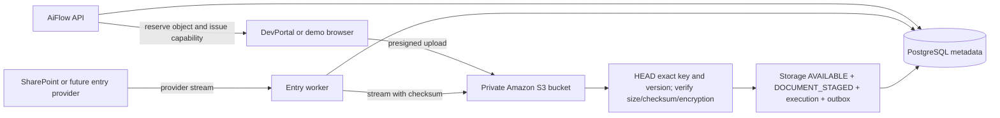

# Object Storage Contract v1

Status: Phase 0B proposal for Phase 1 and Phase 2 implementation.

This contract defines how AiFlow Engine stores and moves source documents and derived processing artifacts. Amazon S3 is the production adapter; core resources use provider-neutral storage-object identifiers.

## Non-negotiable boundary

- PostgreSQL is authoritative for object ownership, lifecycle status, references, retention, and deletion intent.
- S3 is authoritative for encrypted object bytes and S3-verified object metadata.
- An object is usable only when both systems agree that the exact immutable version is `AVAILABLE`.
- Document and processing bytes never enter PostgreSQL, RabbitMQ, logs, traces, Sentry, or metrics.
- The API creates metadata and short-lived upload capabilities; it does not proxy browser document bytes.
- Entry workers stream provider bytes directly into S3 with backpressure; they do not first copy the whole file to memory or local disk.
- Workers read only the object needed by their current stage and stream it to the approved provider or next storage object.
- S3 bucket names, keys, version IDs, KMS details, and presigned URLs remain infrastructure data. Domain packages use `storageObjectId`.

Browser-to-S3, external-provider-to-worker, and worker-to-approved-provider traffic still uses TLS. The avoided path is document transfer through internal APIs or message queues.

## Converged staging flow



Direct upload and provider ingestion differ only before the storage object becomes available. Both converge on the same transactional `DOCUMENT_STAGED` boundary defined by the [execution lifecycle](execution-lifecycle.md).

## Production bucket baseline

The target is one private AiFlow Engine bucket per environment and AWS Region. A platform-approved equivalent separation is acceptable; creating one bucket per tenant is not the baseline.

Required bucket controls:

- all four S3 Block Public Access settings enabled at account and bucket level;
- Object Ownership set to `Bucket owner enforced`, with ACLs disabled;
- bucket versioning enabled;
- default SSE-KMS using one platform-managed customer KMS key per environment;
- S3 Bucket Key enabled unless platform security requires DSSE-KMS or a different key policy;
- bucket policy denies non-TLS requests, unintended public/cross-account access, wrong encryption, and unapproved principals;
- conditional-write policy for engine object prefixes so existing keys cannot be overwritten;
- CORS limited to approved DevPortal/demo origins, required upload methods, and the exact signed headers;
- lifecycle safety rules for abandoned multipart uploads and unexpected noncurrent/delete-marker cleanup;
- platform-approved access logging, CloudTrail data-event, replication, and alerting policy.

AWS recommends disabling ACLs with `Bucket owner enforced` for modern S3 use cases in its [Object Ownership guidance](https://docs.aws.amazon.com/AmazonS3/latest/userguide/about-object-ownership.html), and recommends enabling all S3 Block Public Access settings in its [public-access guidance](https://docs.aws.amazon.com/AmazonS3/latest/userguide/access-control-block-public-access.html).

S3 Bucket Keys reduce KMS request traffic and cost for SSE-KMS workloads according to AWS's [Bucket Key documentation](https://docs.aws.amazon.com/AmazonS3/latest/userguide/bucket-key.html). Per-tenant KMS keys and S3 Object Lock are not initial requirements; either needs a compliance requirement, operating model, cost review, and ADR.

## Storage-object record

`packages/storage` owns a provider-neutral `storage_objects` record implemented through the PostgreSQL adapter. Every physical source or derived object has one row reserved before bytes are accepted.

Conceptual fields:

| Field                                                | Meaning                                                               |
| ---------------------------------------------------- | --------------------------------------------------------------------- |
| `storageObjectId`                                    | Application-generated UUIDv4 used by domain records and messages      |
| `tenantId`, `projectId`                              | Mandatory ownership boundary                                          |
| `kind`                                               | Provider-neutral object purpose                                       |
| `status`                                             | Current durable storage lifecycle                                     |
| `stateVersion`                                       | Guard for lifecycle, retention, reconciliation, and deletion commands |
| `locationAlias`                                      | Configuration alias such as `PRIMARY`; never a client-supplied bucket |
| `objectKey`, `versionId`                             | Confidential adapter location for the exact immutable S3 version      |
| `sizeBytes`, `contentType`                           | Verified stored metadata                                              |
| `checksumAlgorithm`, `checksumType`, `checksumValue` | Verified integrity metadata                                           |
| `encryptionMode`, `encryptionKeyRef`                 | Safe verification projection, not key material                        |
| `retentionUntil`                                     | Earliest eligible deletion time                                       |
| `reservedAt`, `availableAt`, `deletedAt`             | Lifecycle timing                                                      |
| `failureCode`, `deleteAttemptAt`                     | Safe reconciliation/deletion state                                    |

Object status is limited to:

| Status           | Meaning                                                                   |
| ---------------- | ------------------------------------------------------------------------- |
| `RESERVED`       | A unique key is allocated; bytes are not yet trusted or usable            |
| `AVAILABLE`      | Exact version, size, checksum, and encryption were verified               |
| `DELETE_PENDING` | Retention permits deletion and a durable delete intent exists             |
| `DELETED`        | The exact accepted version was confirmed removed; metadata is a tombstone |
| `ABANDONED`      | Reservation expired or upload failed before becoming available            |

Domain records reference `storageObjectId`. `documents` references its source storage object; a successful stage attempt references its single canonical extraction, mapping, review, or delivery output. A separate execution-artifact table is deferred until a stage demonstrably needs multiple independently retained outputs. `storage_objects` does not use a polymorphic `owner_type/owner_id` relationship.

The database schema details and retention of tombstone metadata are governed by the [PostgreSQL contract](postgresql-v1.md).

## Object kinds

Initial provider-neutral kinds are:

- `SOURCE_DOCUMENT`;
- `EXTRACTION_RESULT`;
- `MAPPING_RESULT`;
- `REVIEW_ARTIFACT` for an immutable reviewer-approved replacement defined by [`review-v1.md`](review-v1.md);
- `DELIVERY_ARTIFACT` only when a destination contract requires a stored payload.

Destination receipts, provider operation IDs, and small safe response metadata stay in PostgreSQL rather than creating an S3 object without a real payload.

New providers do not create new core kinds merely to include their brand name. A new kind must represent new product lifecycle or retention behavior.

## Key contract

The application generates keys; clients and connectors never provide them.

```text
v1/t/<tenant-scope-hash>/o/<storage-object-uuid>
```

- `tenant-scope-hash` is lowercase hex SHA-256 of the normalized tenant ID. It creates a safe stable path segment; it is not an authorization mechanism or secret.
- `storage-object-uuid` is the `storageObjectId`, making the key non-sequential and non-guessable.
- Environment and Region are represented by the bucket, not repeated in every key.
- Original filenames, project/workflow names, provider IDs, email addresses, customer names, and document types never appear in keys.
- File extensions are not required. Verified content type and original safe filename are database metadata.
- Key-format changes create a new leading version such as `v2`; existing keys are never renamed in place.

`(location_alias, object_key)` is unique in PostgreSQL. S3 writes include `If-None-Match: *`, and the bucket policy enforces conditional writes for engine object-creation operations. AWS documents conditional writes for both `PutObject` and `CompleteMultipartUpload` in its [overwrite-prevention guidance](https://docs.aws.amazon.com/AmazonS3/latest/userguide/conditional-writes.html).

Bucket versioning is defense in depth, not permission to overwrite. When an object becomes available, its S3 `versionId` is persisted; every worker read and deletion addresses that exact version.

## Integrity contract

ETag is treated as an opaque concurrency/part receipt, never as a content checksum.

AiFlow uses S3 additional checksums:

- algorithm: `SHA256` for the initial contract;
- single-part `PutObject`: `FULL_OBJECT` checksum;
- multipart upload: `COMPOSITE` SHA-256 with consecutive part numbers and each part checksum supplied to completion;
- the record always stores both algorithm and checksum type so clients never compare a composite value with a whole-file digest.

The browser also supplies a SHA-256 digest of the full source content for request identity and later end-to-end verification. It computes the digest incrementally without base64 conversion or loading the whole document into memory. For multipart upload this client digest is stored separately from S3's composite checksum and is verified during the first full worker stream before bytes leave for OCR. It is never mislabeled as an S3-verified full-object checksum.

AWS distinguishes full-object and composite checksums and supports composite SHA-256 for multipart uploads in its [object-integrity documentation](https://docs.aws.amazon.com/AmazonS3/latest/userguide/checking-object-integrity-upload.html).

Rules:

1. The upload plan signs the expected checksum header where the operation supports it.
2. A provider-ingestion worker computes the required checksum while streaming and supplies it to S3.
3. Completion calls `HeadObject` for the exact key/version and requests checksum data.
4. Size, content type, checksum algorithm/type/value, encryption mode/key, and object status must match the reservation.
5. Any mismatch marks the reservation failed/abandoned, prevents `DOCUMENT_STAGED`, and schedules deletion.
6. Worker reads request the accepted version and checksum mode; checksum mismatch is a permanent storage-integrity failure and security/operations alert.
7. Raw client content type and filename are hints. A bounded pre-processing read validates supported file signatures before sending bytes to OCR or another provider.

S3 provides strong read-after-write consistency for object PUT/DELETE and object metadata reads, including `HEAD`, according to the [S3 consistency model](https://docs.aws.amazon.com/AmazonS3/latest/userguide/Welcome.html#ConsistencyModel). AiFlow still performs `HeadObject` because it validates the exact contract, not because it waits for eventual consistency.

## Direct browser upload

### Session creation

`POST /api/v1/workflows/:workflowId/upload-sessions`:

1. authenticates the actor and authorizes the tenant/project/workflow;
2. validates active workflow, filename metadata, allowed type, size, and full-content SHA-256 format;
3. applies per-tenant active-session and byte quotas;
4. creates the upload-session and `RESERVED` storage-object rows idempotently;
5. pins the workflow's exact active version on the session;
6. generates the server-owned key and an operation-specific SigV4 upload plan;
7. returns the plan without persisting or logging its URLs.

For multipart, the engine creates the S3 multipart upload only after the database reservation exists and stores the returned upload ID server-side. If S3 creation succeeds but persisting that upload ID fails, the bucket's incomplete-upload lifecycle rule removes the untracked parts; normal retries use the durable session rather than guessing an upload ID.

Initial proposed values:

| Control                           | Value                         |
| --------------------------------- | ----------------------------- |
| Maximum source size               | 100 MiB                       |
| Single/multipart threshold        | 64 MiB                        |
| Multipart part size               | 16 MiB, except the final part |
| Upload-session lifetime           | 60 minutes                    |
| Each presigned URL lifetime       | 15 minutes                    |
| Abandoned reservation eligibility | 24 hours after reservation    |

The server selects `SINGLE_PUT` or `MULTIPART`; client input cannot select a cheaper validation path or exceed configured limits. Threshold and part size may change without an API version change because the returned plan is self-describing.

Single-part plan example:

```json
{
  "data": {
    "uploadSessionId": "uuid",
    "expiresAt": "2026-07-16T10:00:00Z",
    "plan": {
      "type": "SINGLE_PUT",
      "method": "PUT",
      "url": "<short-lived presigned URL>",
      "headers": {
        "content-type": "application/pdf",
        "if-none-match": "*",
        "x-amz-checksum-sha256": "<base64 checksum>"
      }
    }
  }
}
```

Multipart plans contain fixed part size/count and a relative part-capability path template. The S3 multipart upload ID remains server-side and is never returned to the browser.

For each consecutive part, the browser computes SHA-256 and calls:

```text
POST /api/v1/upload-sessions/:uploadSessionId/parts/:partNumber/upload-capabilities
```

The engine validates the expected part number/size, pins the first accepted checksum for that part, and returns a presigned `UploadPart` URL whose checksum header is signed. A refresh is allowed only for the same session, part number, size, and checksum; changing the file requires a new session.

The browser returns ordered part number, ETag, and checksum values to the completion endpoint. The engine compares them with the pinned part records and S3 state, then—not the browser—calls `CompleteMultipartUpload` with `If-None-Match: *`.

Expired part capabilities may be refreshed only after reauthentication, reauthorization, and confirmation that the same session remains active. Refresh never changes bucket, key, checksum contract, part size, or object identity.

Presigned URLs are bearer capabilities and can be reused until expiry unless the underlying session/credentials are revoked. AWS documents this behavior and SigV4 checksum support in its [presigned URL guidance](https://docs.aws.amazon.com/AmazonS3/latest/userguide/using-presigned-url.html). The bucket policy additionally caps `s3:signatureAge` at the approved maximum.

### Session completion

`POST /api/v1/upload-sessions/:uploadSessionId/complete` is authenticated and requires an idempotency key.

1. Load the session by trusted tenant, reauthorize the workflow/project, require `acceptingNewDocuments=true`, and require the current active version to equal the session's pinned version.
2. For multipart, validate the exact expected part set and call S3 completion once; retries reconcile the stored upload ID and object state.
3. `HeadObject` the reserved key and exact returned version with checksum mode.
4. Validate size, checksum, content type, encryption, and conditional-write outcome.
5. In one PostgreSQL transaction, mark the storage object `AVAILABLE`, create immutable document metadata, create the execution in `QUEUED`, create its extraction outbox command, complete idempotency, and record audit facts.
6. Return the same document/execution for duplicate completion requests.

If S3 completion succeeds but the database transaction fails, the session remains recoverable. The next idempotent completion or reconciler validates the existing exact object and commits the missing database transition; it never uploads another copy.

If the workflow was deactivated or switched to a different active version after session creation, completion does not create a document/execution. It returns a stable non-retryable workflow-intake error, abandons the reservation, and schedules exact-version cleanup. The user starts a new session against the current active version.

`DELETE /api/v1/upload-sessions/:uploadSessionId` aborts an active multipart upload where applicable, marks the reservation abandoned, and schedules any completed unexpected version for deletion. It cannot delete an available document.

## Provider-entry ingestion

SharePoint and future entry connectors use the same storage port:

1. Load the active managed binding/version, persist/deduplicate the provider source identity, and reserve one storage object.
2. Open an authenticated provider download stream.
3. Stream through a bounded checksum/size transform directly to conditional S3 upload, using multipart only when size/stream behavior requires it.
4. Apply backpressure and per-tenant/per-connection concurrency limits; never buffer the complete document.
5. Revalidate provider version/eTag when the source may have changed during download.
6. `HeadObject` and verify the exact S3 result.
7. Recheck that the binding/version remains eligible, then atomically mark storage available and create `DOCUMENT_STAGED`, execution, outbox, and audit facts.

If the final binding/version check fails, the object does not become a document. The reservation is abandoned and exact-version cleanup is scheduled.

If the source changes during transfer, the attempt is abandoned and retried against the new source version according to connector policy. It does not publish an execution for ambiguous bytes.

External provider download traffic uses provider-required HTTPS. EKS-to-S3 traffic uses the platform's S3 VPC endpoint where available so it does not traverse a NAT/internet path. AWS documents that an S3 gateway VPC endpoint provides VPC access without an internet gateway or NAT device in its [VPC endpoint guidance](https://docs.aws.amazon.com/vpc/latest/privatelink/vpc-endpoints-s3.html).

## Derived artifacts and reads

Extraction and mapping outputs that contain tenant document data are immutable storage objects, not PostgreSQL JSON fields or RabbitMQ payloads.

Rules:

- Reserve a new storage object for each logically new attempt output.
- Retry of the same interrupted write reuses its reservation; a new stage attempt creates a new reservation.
- In one guarded PostgreSQL transaction, mark output available and commit the stage transition that references it.
- If output upload succeeds but the stage transition loses its lease or fails, keep the reservation for reconciliation and later deletion; never attach it to another tenant/execution.
- Successful later stages may reuse checksum-verified artifacts from earlier stages and manual retry chains.
- Reads use exact `versionId`, stream with bounded memory, validate checksum, and close/abort promptly on cancellation or timeout.
- Temporary local files are forbidden by default. A provider adapter that demonstrably requires a file path needs an ADR/security review, encrypted ephemeral volume, strict size limit, and guaranteed cleanup.

No general presigned-download API is part of v1. Phase 5 adds only the task-scoped review source-access endpoint defined in [`review-v1.md`](review-v1.md): it authorizes the exact tenant/project/task/document relation and issues a short-lived, exact-version, read-only capability. Bucket/key/version input from the caller is never accepted.

## Idempotency and reconciliation

Every storage operation has one stable database reservation before S3 mutation. The reservation bridges the non-transactional S3/PostgreSQL boundary.

| Durable state                          | S3 observation                   | Reconciliation action                                       |
| -------------------------------------- | -------------------------------- | ----------------------------------------------------------- |
| `RESERVED` within active session/lease | no completed object              | Continue or wait; do not create a document                  |
| expired `RESERVED`                     | no object                        | Mark `ABANDONED`; abort multipart if known                  |
| `RESERVED`                             | exact object exists and matches  | Finalize the interrupted database transition idempotently   |
| `RESERVED`                             | object exists but mismatches     | Mark abandoned, alert, and delete exact version             |
| `AVAILABLE`                            | exact version exists and matches | Healthy                                                     |
| `AVAILABLE`                            | exact version missing/mismatched | Storage invariant failure; stop dependent work and alert    |
| `DELETE_PENDING`                       | exact version exists             | Retry permanent version deletion                            |
| `DELETE_PENDING`                       | exact version absent             | Mark `DELETED`                                              |
| `DELETED`                              | exact version reappears          | Security/infrastructure alert; do not restore automatically |

Reconciliation uses database keys and exact `HeadObject`; normal runtime does not require broad `ListBucket`. Bucket inventory may be used only by an approved operator job to detect objects outside database reservations.

S3's lifecycle `AbortIncompleteMultipartUpload` is a safety net because uploaded parts incur storage cost until completion or abort; AWS recommends this control in its [multipart lifecycle guidance](https://docs.aws.amazon.com/AmazonS3/latest/userguide/mpu-abort-incomplete-mpu-lifecycle-config.html). The application still aborts known failed sessions promptly.

## Retention and deletion

PostgreSQL retention state is authoritative. S3 lifecycle cannot determine when an execution becomes terminal, so it does not implement the primary 30-day post-terminal policy.

Initial rules:

- source and derived objects become eligible 30 days after the last execution/retry-chain or review reference becomes terminal;
- a new valid reference may extend `retentionUntil` but never shorten it;
- active review, legal/security hold, migration, or provider requirement blocks deletion;
- abandoned reservations are eligible after 24 hours;
- known incomplete multipart uploads are aborted immediately on failure/expiry, with a one-day S3 lifecycle abort safety rule proposed;
- database storage tombstones remain for the one-year execution/audit window;
- S3 noncurrent-version/delete-marker cleanup is a platform safety policy, not the primary deletion workflow.

Deletion sequence:

1. Scheduler claims an eligible object and commits `DELETE_PENDING`, incremented `stateVersion`, command outbox, and audit intent.
2. Storage worker permanently deletes the recorded S3 `versionId`, not merely the current key/delete marker.
3. It verifies the exact version is absent.
4. It commits `DELETED`, timestamp, and audit outcome.
5. A failure records a safe error and bounded retry time; metadata remains.

S3 Versioning retains overwritten/deleted versions and uses delete markers for ordinary key deletion, as described in AWS's [versioning guidance](https://docs.aws.amazon.com/AmazonS3/latest/userguide/versioning-workflows.html). Therefore version-specific deletion and verification are mandatory when retention requires permanent removal.

Provider copies are deleted or retained according to the provider contract and recorded separately. Deleting AiFlow's S3 object does not falsely claim that an OCR, Microsoft, review, or destination provider copy was removed.

## IAM, network, and disclosure

Production uses EKS Pod Identity or IRSA with temporary credentials. Static AWS keys are forbidden.

Proposed least-privilege split:

| Runtime                    | Required capability                                                                                                                                         |
| -------------------------- | ----------------------------------------------------------------------------------------------------------------------------------------------------------- |
| API                        | Presign conditional upload; multipart create/complete/abort; exact-version metadata/checksum read; required scoped KMS checksum permissions; no list/delete |
| Worker                     | Exact-version object read/metadata, conditional write, multipart operations, and required KMS access                                                        |
| Scheduler/retention worker | Exact-version metadata/delete, reconciliation, and required scoped KMS access; no general bucket listing                                                    |
| Migration job              | No S3 or KMS permission                                                                                                                                     |

The final IAM actions, KMS grants, bucket/access-point policy, and role split are platform-owned and tested. Ordinary runtime roles do not need bucket-policy mutation, KMS administration, bucket deletion, public ACL, or unrestricted cross-bucket access.

AWS authorizes `HeadObject` through `s3:GetObject`/`s3:GetObjectVersion`, and checksum mode on SSE-KMS objects also requires scoped KMS permissions, as documented by the [HeadObject API](https://docs.aws.amazon.com/AmazonS3/latest/API/API_HeadObject.html). The initial synchronous completion contract accepts that narrowly scoped API-role capability while application code exposes metadata only and never reads a body. If Security requires IAM-level prevention of API byte reads, completion must become an asynchronous worker verification contract before implementation freeze; it cannot be claimed through a nonexistent HEAD-only S3 permission.

Server-side paths use the same-Region S3 gateway/interface endpoint selected by the platform. Browser presigned uploads may use the regional public S3 service endpoint because browsers are outside the VPC; the bucket remains private and the only authority is the narrow signed capability.

The system never logs or emits to RabbitMQ/PostgreSQL:

- presigned URLs or query strings;
- document/extracted content;
- KMS plaintext/data keys;
- authorization headers or AWS session credentials.

Safe telemetry includes storage-object ID, tenant-safe correlation ID, operation, byte count, duration, checksum algorithm/type, result code, and retry count. Bucket, key, version, and KMS identifiers are redacted or allow-listed only in restricted operational logs.

## Scalability and resource bounds

- API upload-session creation is metadata-only and horizontally scalable.
- Browser upload traffic goes directly to S3 and does not consume API bandwidth or worker memory.
- Provider ingestion and artifact workers stream with backpressure and bounded buffers.
- Worker concurrency is bounded globally, per tenant, and per provider/connection; S3 capacity is not permission to overload Microsoft Graph, OCR, PostgreSQL, or KMS.
- Multipart part concurrency and presigning are bounded; plans never contain unbounded part counts.
- Object keys use random UUIDs, avoiding sequential hot naming and tenant filename collisions.
- All SDK calls have finite connection, request, idle-body, and total-operation timeouts plus bounded retries.
- KMS throttling, S3 `SlowDown`, checksum failure, and incomplete stream metrics are distinct from provider/business errors.
- Cost metrics cover stored bytes by kind/status, request count, incomplete multipart bytes, version/noncurrent bytes, KMS requests, and egress.

The initial 10 documents/second sustained and 50 documents/second burst tests include concurrent direct uploads, provider streams, stage reads, deletion, and at least 100 active tenants. Document-size distribution—not only document count—drives bandwidth and worker sizing.

## Local development and contract tests

Phase 0B adds no bucket or container.

The Phase 1 storage slice adds:

- a small pinned S3-compatible local container for fast offline development;
- the production AWS SDK v3 adapter configured through endpoint/location settings rather than a second fake domain adapter;
- local bucket initialization with versioning, deterministic test credentials, and safe reset commands;
- synthetic documents only;
- contract tests for conditional write, exact-version read/delete, streaming/backpressure, checksums, single/multipart upload, duplicate completion, abandoned uploads, and tenant key isolation.

An emulator cannot prove AWS IAM, KMS, bucket policy, VPC endpoint, CORS, presigned signature age, lifecycle timing, or every checksum/versioning detail. Before Phase 1 exits, the same AWS-specific contract suite runs against a disposable non-production AWS bucket with exact target controls. The local container choice and exact image are verified/pinned during the Phase 1 dependency freeze; production behavior cannot branch on the emulator.

The pinned local/test emulator is Moto 5.2.2. Moto does not return S3 additional
checksum response headers, so local configuration explicitly enables a metadata
fallback while the adapter still recalculates SHA-256 over every read stream.
Production configuration rejects this fallback and requires S3's checksum
headers. The disposable real-AWS contract run remains a platform validation gate.
Run that gate with `bun run test:aws-s3-contract` after supplying
`AWS_S3_CONTRACT_BUCKET`, `AWS_S3_CONTRACT_REGION`, and
`AWS_S3_CONTRACT_KMS_KEY_ID` through the approved CI secret/configuration path.

Local reset tooling must verify an explicit local endpoint and bucket prefix before deleting anything. It refuses to run against AWS or an unknown endpoint.

## Required implementation evidence

1. Browser bytes never enter the API, PostgreSQL, or RabbitMQ.
2. Single and multipart completion accept exactly one immutable S3 version and create one document/execution.
3. Duplicate upload completion returns the same execution.
4. Conditional writes prevent a different object version at an accepted key.
5. Checksum, size, content-type, encryption, or version mismatch prevents staging.
6. SharePoint/provider ingestion streams without whole-object memory/disk buffering and survives worker termination.
7. An S3 success followed by database failure is finalized or deleted without duplicate execution.
8. A stage output committed after lease loss cannot become the execution's artifact.
9. Exact-version reads and deletes behave correctly with bucket versioning enabled.
10. Deletion is tenant-isolated, auditable, retryable, and retains a database tombstone.
11. Presigned URLs expire, are operation/key/checksum constrained, and never appear in logs or durable messages.
12. Tenant/provider concurrency and 100 MiB limits remain bounded under sustained/burst tests.

## Platform and product confirmations still required

- `S3-01`: account, Region, bucket naming, ownership, versioning, Block Public Access, and infrastructure owner.
- `S3-02`: KMS key/alias, key policy, S3 Bucket Key approval, rotation, and recovery behavior.
- `S3-03`: API/worker/scheduler Pod Identity or IRSA roles, exact IAM/KMS actions including synchronous API checksum verification, VPC endpoint, and bucket/endpoint policies.
- `S3-04`: approved browser origins, regional endpoint, CORS headers, presigned signature-age cap, and gateway behavior.
- `S3-05`: lifecycle rules, noncurrent/delete-marker policy, inventory/audit logging, replication, and restore guarantees.
- `PRODUCT-01`: source/artifact retention, maximum size/page count, allowed document types, and tenant upload/concurrency quotas.
- `SECURITY-01`: whether malware scanning, per-tenant keys, Object Lock, data residency, or legal holds are required.

These inputs may tighten controls or operational values. They do not change the provider-neutral storage-object boundary or the direct/streaming transfer architecture.
